<h1> FFM Pipeline Web 文档 - 概览 </h1>

[TOC]

网站的页面及功能介绍

### 一、登录

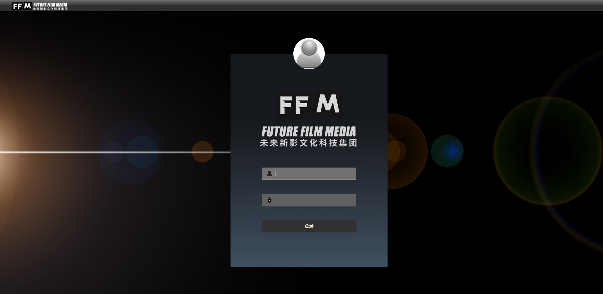

- 用户输入用户名、密码之后，方可登陆。

网站暂时不提供用户注册，如果需要使用，需要向公司管理员联系。

### 二、主页

主页是一个欢迎页面，暂无具体功能，用户可以通过顶部菜单切换页面。

### 三、项目页面

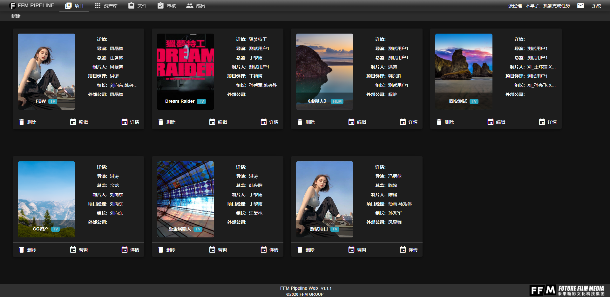

项目页面可以查看、管理所有项目。还可以通过报表快速生成项目进度图。

### 四、镜头页面

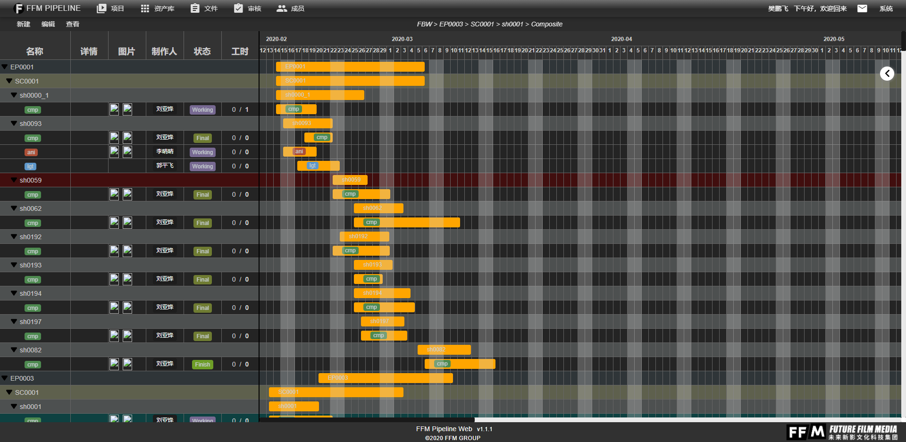

- 用户可以通过点击项目图片进入该项目的镜头页面。

镜头页面可以查看已选择的项目下，所有镜头任务的各种信息、状态、进度以及提交历史等。

### 五、资产页面

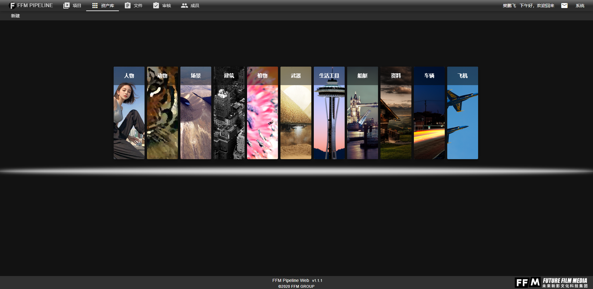

资产页面可以查看公司现有资产库，查看资产库中的资产文件，资产信息，以及缩略图。

### 六、文件页面

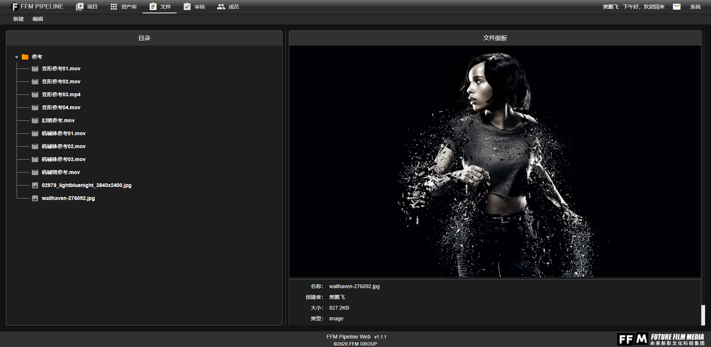

文件页面属于公司内部信息，仅供公司内部员工访问和操作。
提供文件的上传功能。用户仅仅可以创建、上传及删除文件夹和文件。

### 七、审核页面

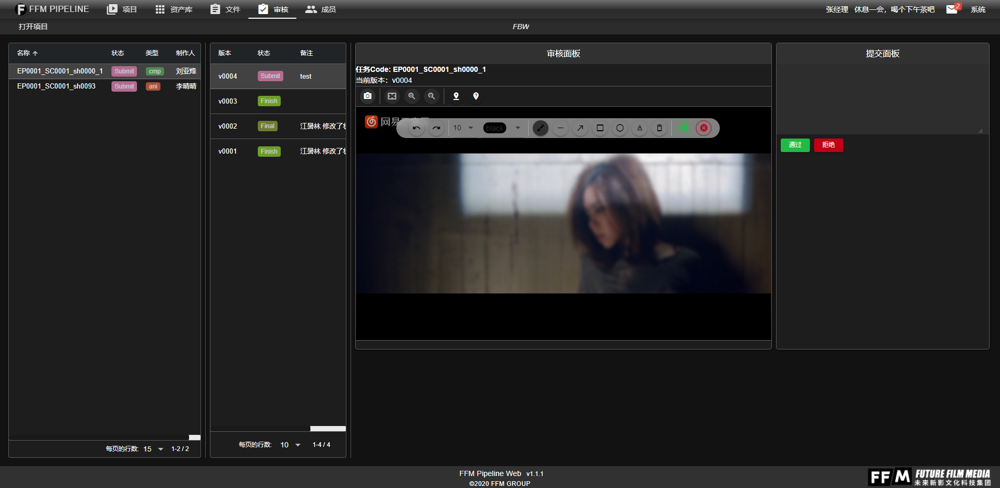

审核页面是一个权限页面。只有具有审核权限的用户可以访问该页面。该页面可以查看制作人提交的任务，并且在该页面批注并审核该任务。
同时，审核页面也是外部客户用户对完成的任务进行批注的页面。外部客户用户可以打开审核页面，选择需要查看的项目，并选择已经完成的任务，可以添加批注。

### 八、成员页面

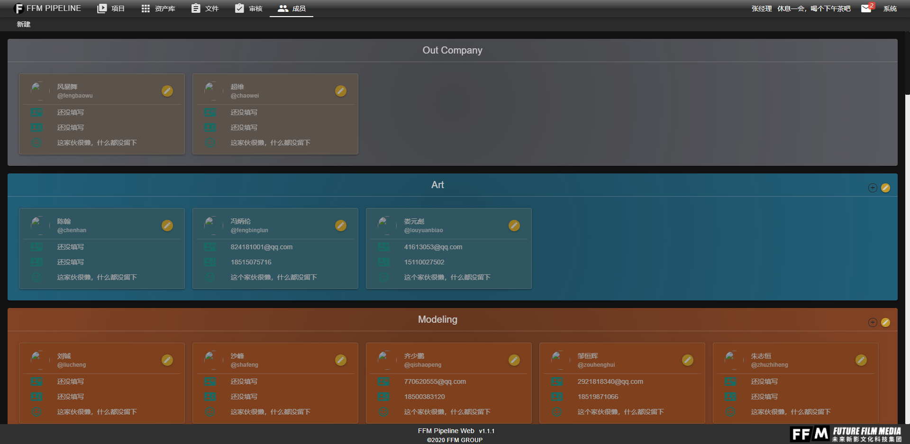

成员页面信息属于公司内部信息，外部用户无法查看。
页面展示所有公司员工基本信息，方便互相联系。

### 九、其他

除了上述分类，网站还有一些单独的窗口级别的页面。

#### 个人信息

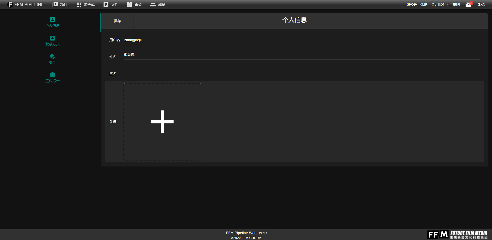

该页面显示当前登录用户信息，用户可以查看并且修改。

##### 打开方式

通过菜单栏顶部的用户名，可以打开**个人信息**：

##### 该页面提供的功能

- 修改个人信息
- 修改密码
- 查看工作报告
- **注意：用户名无法修改。**

#### 消息页面

通过点击菜单栏右侧的消息按钮，可以在打开**消息页面**：

消息盒子按消息发送时间，由近至远展示消息。消息的类型不同，会有细微差别，这样会有效帮助用户更快速地阅读消息。

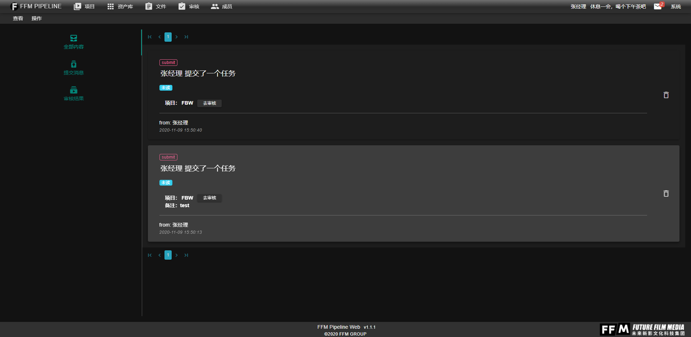

> 用户操作:
> - 点击消息来完成**阅读**
> - 点击消息右侧的删除按钮来完成**删除**
> - 以及点击去审核按钮跳转**审核页面**

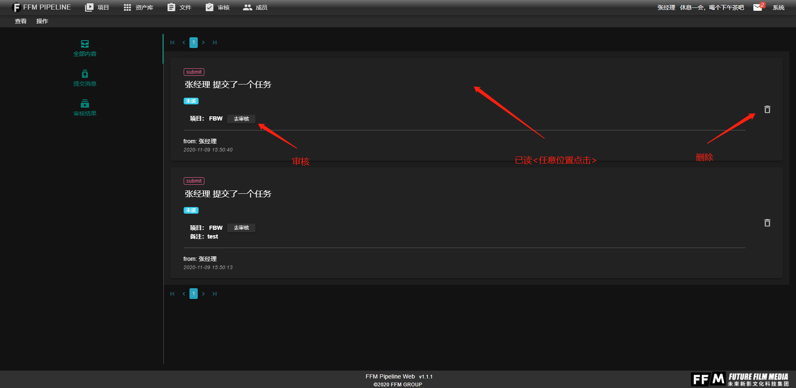 

##### 消息分类

消息盒子提供分类显示，可以单独显示主要的信息，如：审核、提交等。

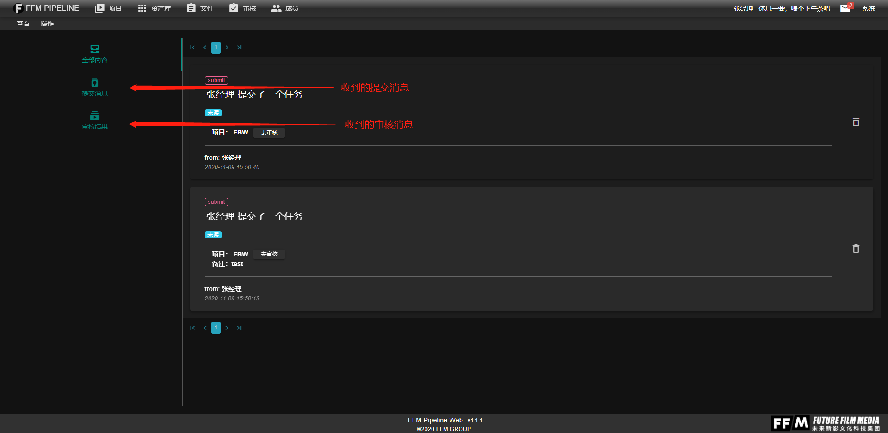

