<h1>FFM Pipeline Web 文档 - 资产页面</h1>

<!-- *注：资产页面与镜头页面大体操作相同，本页面只介绍不同点，相同点请参看镜头页面。* -->

[TOC]

## 资产仓库操作

### 新建资产仓库
点击工具栏中 **** 下的 **** 打开新建 **对话框** :
**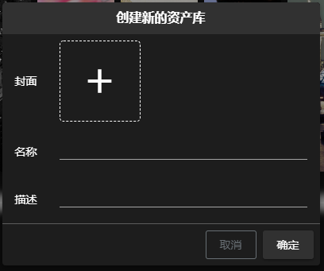**
信息确认后点击 **确定** 完成新建
> 注:
> - 封面图片为选填项
> - 名称为必填项, 并且至多 64 个字符
> - 描述为必填项, 并且至多 100 个字符

### 修改资产仓库
鼠标悬停在 **** 上, 点击 **** 按钮打开修改 **对话框** :
**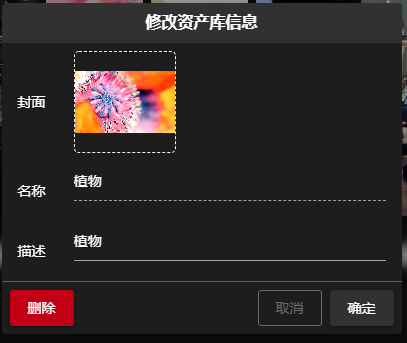**
信息确认后点击 **确定** 完成修改
> 注:
> - 封面图片为选填项
> - 描述为必填项, 并且至多 100 个字符

### 删除资产仓库
通过资产修改对话框左下角的 **** 按钮删除. 打开修改资产对话框方式见 [修改资产](#修改资产仓库)

### 进入资产仓库
鼠标悬停在 **** 上, 点击 **** 进入 **资产仓库**

## 资产操作

### 新建文件夹
点击工具栏 **** 下的 **** 按钮, 打开新建文件夹 **对话框**:
**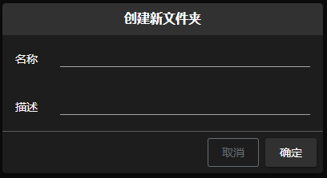**
信息确认后点击 **确定** 完成新建
> 注:
> - 名称为必填项, 并且至多 20 个字符
> - 描述为必填项, 并且至多 200 个字符

### 上传资产
点击工具栏 **** 按钮下的 **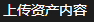** 按钮, 打开上传资产 **对话框**:
****
点击 **+** , 选择要上传的文件, 点击确定完成上传资产
> 注:
> - 上传资产可以批量上传, 同一批次最多上传 5 个

### 修改文件夹
修改文件夹的两种方式
- 右击文件夹打开右键菜单, 点击菜单中的 **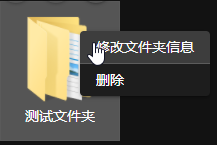** 按钮, 打开修改文件夹 **对话框**
- 选中需要编辑的文件夹, 点击工具栏 **** 下的 **** 按钮, 打开修改文件夹 **对话框**

**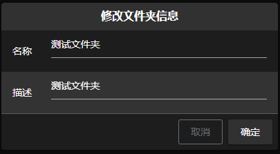**
信息确认后点击 **确定** 完成修改
> 注:
> - 名称为必填项, 并且至多 20 个字符
> - 描述为必填项, 并且至多 200 个字符

### 修改资产信息
双击要修改的资产, 打开资产信息修改 **对话框**
**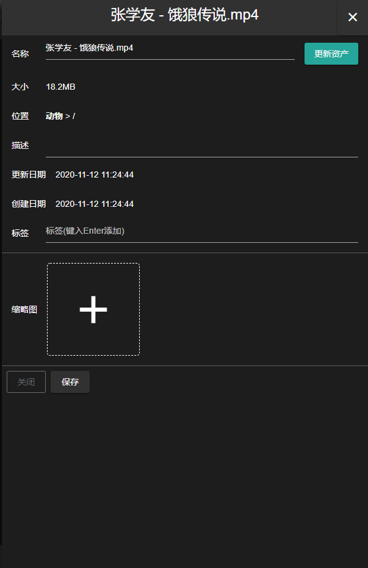**
修改完毕后点击保存完成修改

> 注:
> - 名称最少一个字符最多 64 个字符
> - 描述最多 200 个字符
> - 资产项的图标默认为缩略图第一张

> 更新资产文件的三种方式:
> - 右击文件夹打开右键菜单, 点击菜单中的 **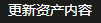** 按钮, 打开上传资产文件 **对话框**
> - 选中需要编辑的资产, 点击工具栏 **** 按钮下的 **** 按钮, 打开上传资产文件 **对话框**
> - 通过修改资产信息中的 **** 按钮, 打开上传资产文件 **对话框**

### 删除文件夹
删除文件夹的两种方式
- 右击文件夹打开右键菜单, 点击菜单中的 **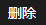** 按钮, 删除该文件夹
- 选中需要删除的文件夹, 点击工具栏 **** 按钮下的 **** 按钮, 删除该文件夹

### 删除资产
删除资产的两种方式
- 右击文件夹打开右键菜单, 点击菜单中的 **** 按钮, 删除该资产
- 选中需要删除的文件夹, 点击工具栏 **** 按钮下的 **** 按钮, 删除该资产

### 移动资产
点击资产选中后 **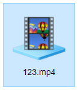** 可以拖拽到当前目录下的文件夹中

#### 多选移动
点击工具栏 **** 按钮下的 **** 按钮, 选择需要移动的资产后, 拖拽到当前目录的文件夹中, 或者点击工具栏 **** 下的 **** 按钮打开移动 **对话框**:
**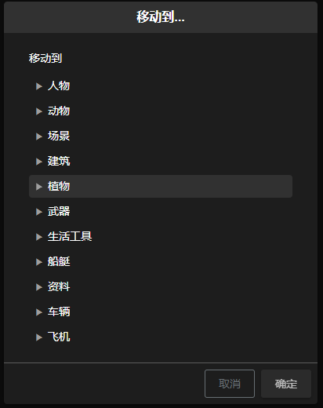**
确定移动位置, 点击 **确定** 完成移动

### 修改展示方式

#### 按图标排列
选中工具栏 **** 按钮下的 **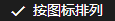** 按钮切换为 **按图标排列**

##### 显示自定义图标
选中工具栏 **** 按钮下的 **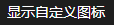** 按钮展示自定义的 **图标**, 否则显示默认的格式图标

#### 按列表排列

在工具栏 **** 按钮下可以调整显示内容
- 显示自定义图标
- 显示大小
- 显示更新者
- 显示创建者
- 显示更新日期
- 显示创建日期
