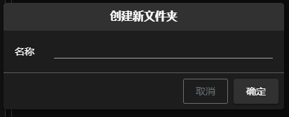
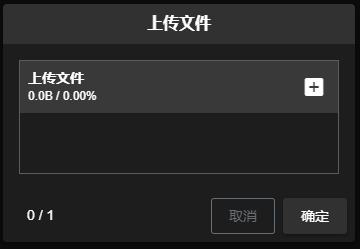
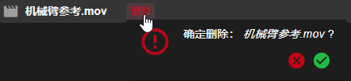

<h1>FFM Pipeline Web 文档 - 文件页面</h1>

[TOC]

## 文件夹操作

### 新建文件夹
#### 新建根目录(首层文件夹)
点击工具栏 **** 下的 **** 按钮, 打开创建文件夹 **对话框**

****
点击确定新建文件夹
> 注:
> - 文件夹名称必填, 最大 20 个字符

#### 新建普通文件夹
两种新建方式:
- 点击工具栏 **** 下的 **** 按钮, 打开创建文件夹 **对话框**
- 鼠标悬停父级文件夹点击 **** 按钮, 打开创建文件夹 **对话框**

****
点击 **确定** 新建文件夹
> 注:
> - 文件夹名称必填, 最大 20 个字符

### 删除文件夹 
鼠标悬停在需要删除的文件夹点击 **** 按钮, 打开删除文件夹 **对话框** :
****
点击 **绿色对勾**, 完成删除

## 文件操作

### 上传文件
两种上传文件方式:
- 选中父级文件夹, 点击工具栏 **** 下的 **** 按钮, 打开上传文件 **对话框**
- 鼠标悬停父级文件夹点击 **** 按钮, 打开上传文件 **对话框**

****
点击 **+** 选择需要上传的文件
点击 **确定** 完成上传

### 删除文件
鼠标悬停在需要删除的文件点击 **** 按钮, 打开删除文件夹 **对话框** :
****
点击 **绿色对勾**, 完成删除
