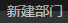
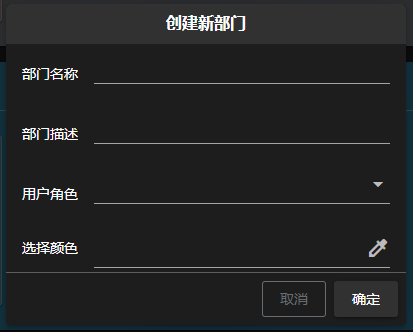
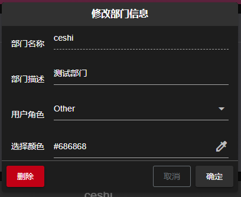
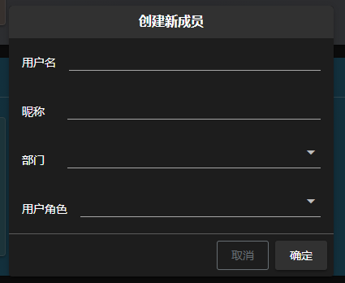
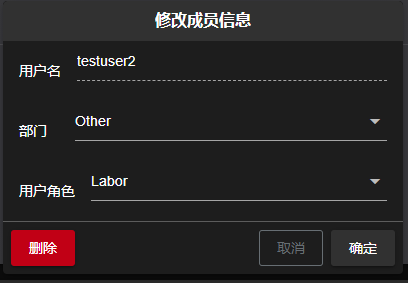

<h1> FFM Pipeline Web 文档 - 成员页面 </h1>

[TOC]

## 部门操作

### 新建部门
点击工具栏中 **** 下的 **** 按钮, 打开新建部门 **对话框**
****
信息确认后, 点击确定完成新建

> 注:
> - 部门名称为必填项, 最大 25 个字符
> - 部门描述为必填项, 最大 80 个字符
> - 用户角色为必选项
> - 部门颜色为可选项, 默认为深灰色

### 修改部门
点击部门卡片右上角的 ****, 打开修改部门的 **对话框**
****

信息确认后, 点击确定完成修改

### 删除部门
打开修改部门对话框, 点击左下角 **** 按钮, 删除部门. 对话框打开方式见 [修改部门](#修改部门) 

## 员工操作

### 新建员工
两种新建方式:
- 点击工具栏右上角 **** 下的 **** 按钮, 打开新建员工 **对话框**
- 点击部门卡片右上角的 ****, 打开新建员工 **对话框**

****
信息确认后, 点击确定完成新建

> 注:
> - 用户名为必填项, 最大 16 个字符
> - 昵称为必填项, 最大 20 个字符
> - 部门为必选项, 通过卡片新建员工不可选择其他部门
> - 用户角色为必选项

### 修改员工信息
点击员工卡片卡片右上角的 ****, 打开修改员工信息的 **对话框**
****
信息确认后, 点击确定完成修改

### 删除员工
打开修改员工对话框, 点击左下角 **** 按钮, 删除员工. 对话框打开方式见 [修改员工](#修改员工信息) 
