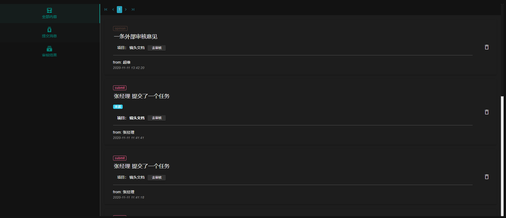
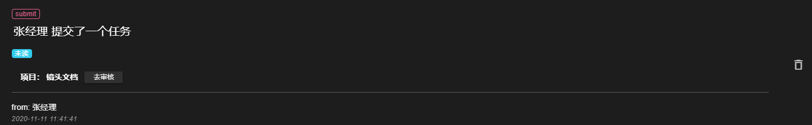
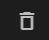
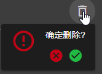
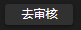

<h1> FFM Pipeline Web 文档 - 消息页面 </h1>

[TOC]

点击菜单栏的消息按钮
****
进入消息页面.
****

## 切换展示内容
点击消息页面左侧的三个按钮(**** **** ****), 切换展示类型.

## 已读消息
****
点击除按钮外的任意位置, 消息即可变为已读.

## 删除消息
点击消息卡片右侧的 **** 按钮, 弹出删除确认框, 点击 **** 中的绿色对勾, 完成删除

## 审核跳转
点击项目卡片上的 **** 按钮, 跳转到消息对应项目的审核界面.

