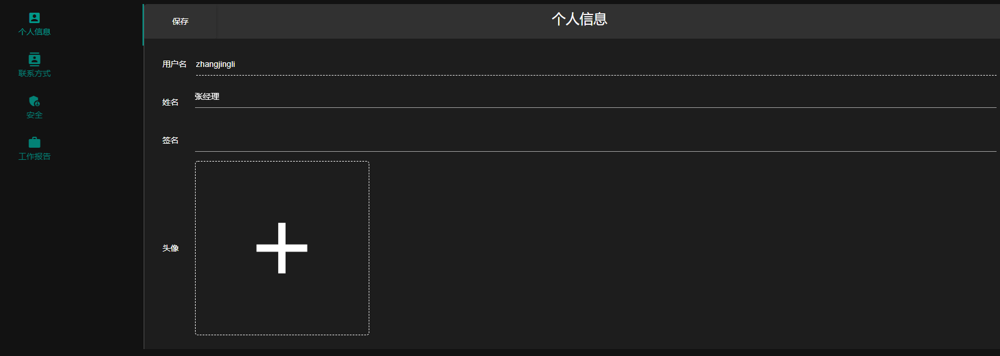
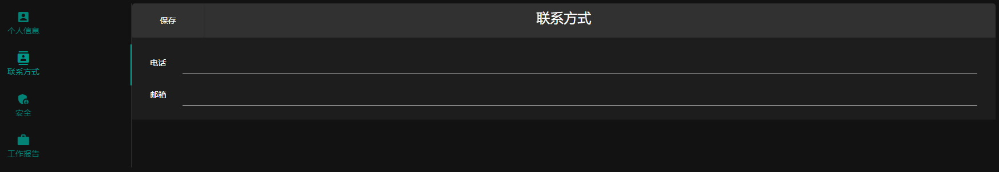
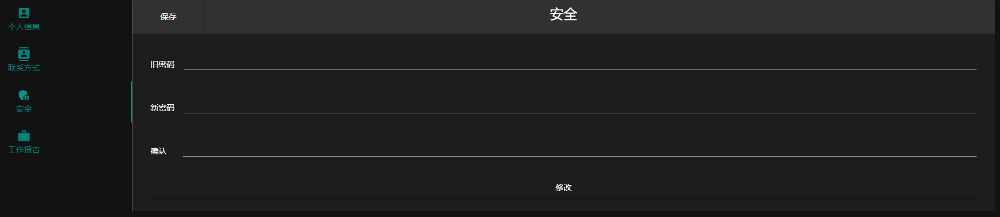
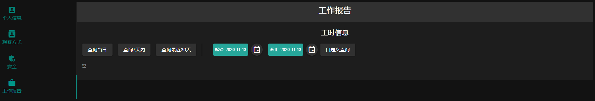
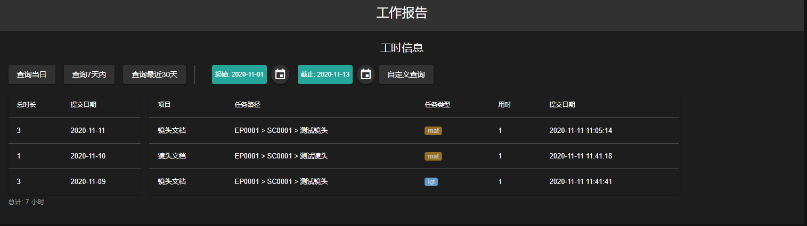

<h1> FFM Pipeline Web 文档 - 个人信息 </h1>

[TOC]

点击菜单栏的姓名, 进入个人信息页面.
****

## 修改个人信息
点击页面左侧的 **** 按钮, 进入个人信息修改页.
****
信息填写完成, 点击左上角的保存按钮修改个人信息

> 注:
> - 用户名自创建之后不可修改
> - 姓名为必填项, 最大 20 字符
> - 签名为选填项, 最大 100 字符
> - 点击头像右侧的 **+** 更新头像
> - 保存在页面的左上角

## 修改联系方式
点击页面左侧的 **** 按钮, 进入联系方式修改页.
****
信息填写完成, 点击左上角的保存按钮修改联系方式

> 注:
> - 电话为选填项, 最大 20 字符
> - 邮箱为选填项, 最大 35 字符
> - 保存在页面的左上角

## 修改密码
点击页面左侧的 **** 按钮, 进入密码修改页.
****
信息填写完成, 点击左上角的保存按钮修改联系方式

> 注:
> - 密码至少 6 字符, 至多 24 字符
> - 旧密码为必填项, 需要和当前账户的密码一致
> - 新密码为必填项
> - 确认为必填项, 需和新密码保持一致
> - 保存在页面的左上角

## 查看工作报告
点击页面左侧的 **** 按钮, 进入工作报告查看页.
****

> 查看方式:
> - 点击 **** 按钮, 查看该用户今天的工作
> - 点击 **** 按钮, 查看该用户最近7天的工作
> - 点击 **** 按钮, 查看该用户最近30天的工作
> - 选择 **** , 点击 **** 按钮, 可查看该用户任意日期的工作

查看结果展示
****

