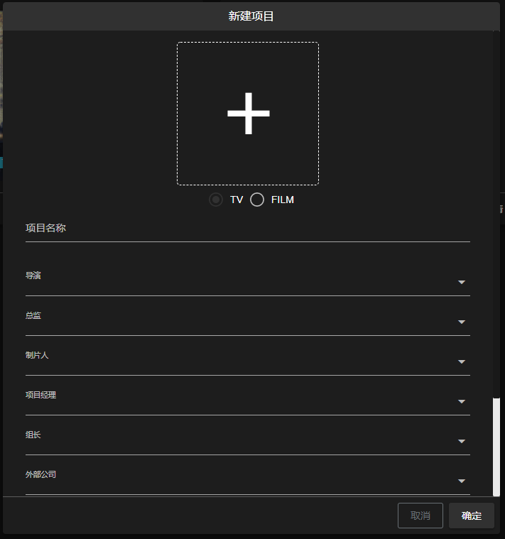
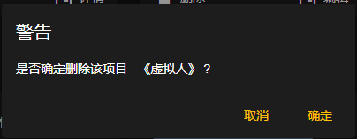
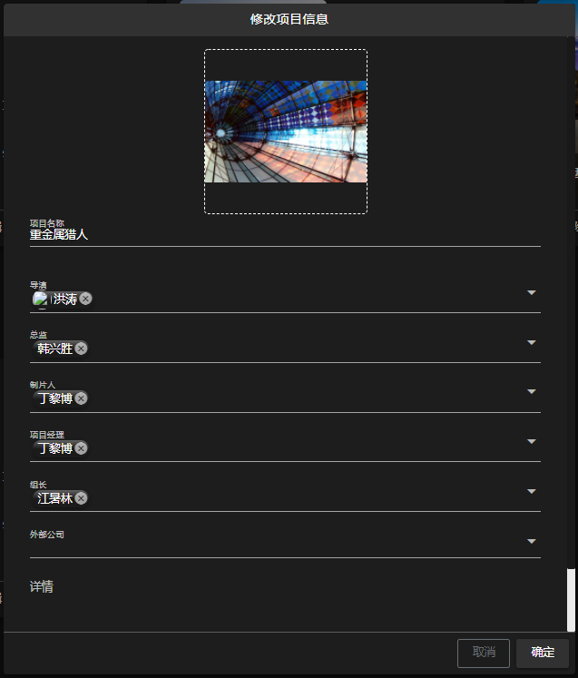
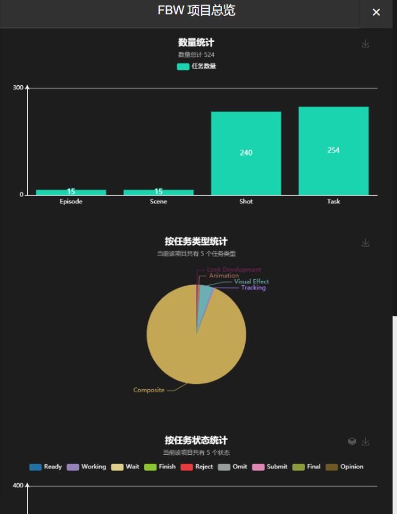

<h1> FFM Pipeline Web 文档 - 项目页面 </h1>

[TOC]

#### 新建项目

点击工具栏 **** 下的 **** 开启新建项目的**对话框**:

所有必填项填完后，点击 **确定** 新建项目。

> 注: 
> - 项目类型为必选项, 默认为 TV
> - 项目名称为必填项, 至少 1 字符, 至多 20 字符
> - 导演为必选项, 可多选
> - 总监为必选项, 可多选
> - 制片人为必选项, 可多选
> - 项目经理为必选项, 可多选
> - 组长为必选项, 可多选
> - 外部公司为可选项, 可多选
> - 详情为选填项, 至多 500 字符

#### 删除项目

点击项目卡片下方的 **** 开启删除项目的**对话框**:

点击 **确定** 删除项目。

#### 修改项目

点击项目卡片下方的 **** 开启编辑项目的**对话框**:

编辑完成后，点击 **确定** 完成编辑。

> 注: 
> - 项目名称为必填项, 至少 1 字符, 至多 20 字符
> - 导演为必选项, 可多选
> - 总监为必选项, 可多选
> - 制片人为必选项, 可多选
> - 项目经理为必选项, 可多选
> - 组长为必选项, 可多选
> - 外部公司为可选项, 可多选
> - 详情为选填项, 至多 500 字符

#### 项目总览

点击项目卡片下方的 **** 开启**右侧抽屉**查看项目总览:

项目总览对项目的任务进行可视化的查看。
