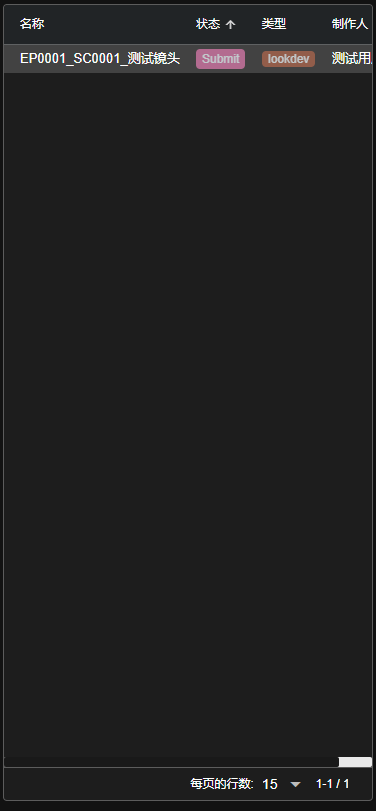
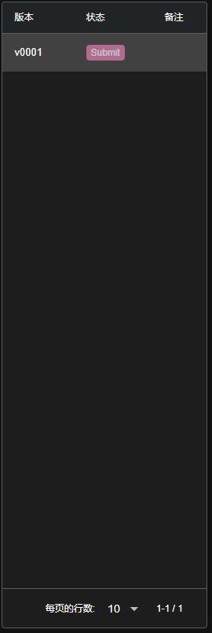
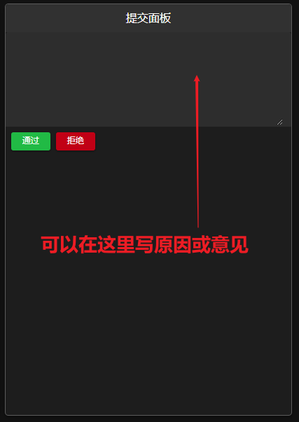
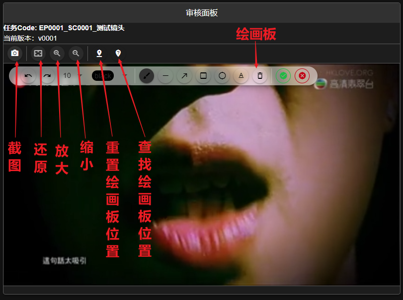
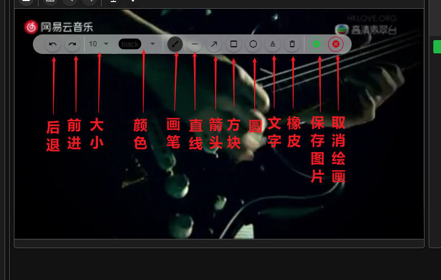

<h1> FFM Pipeline Web 文档 - 审核页面 </h1>

任务选择审核人提交后, 审核人可以在审核页面看到该任务.

[TOC]

## 基本操作
### 选择审核任务
点击工具栏 **** 下需要打开的项目名对应的按钮选择项目
在任务列表里选择需要审核的任务
****
在版本列表里选择审核版本(最新版本可以审核, 之前的版本仅提供查看功能)
****
在审核面板开始审核(面板功能见[详情](#审核面板按钮功能一览图))
****

### 通过审核
提交面板
****

点击提交面板的 **** 按钮, 完成审核

> 注:
> - 原因与意见输入框为选填项, 至多 1000 字符

### 审核拒绝
提交面板
****

点击提交面板的 **** 按钮, 完成拒绝

> 注:
> - 原因与意见输入框为选填项, 至多 1000 字符

### 审核面板按钮功能一览图
****
绘画板功能见 [绘画](#绘画功能一览图)

### 绘画功能一览图
****
