<h1>FFM Pipeline Web 文档 - 镜头页面</h1>

[TOC]

## 进入镜头页面
点击项目卡片中的 **封面** , 进入项目对应的shot页面:
**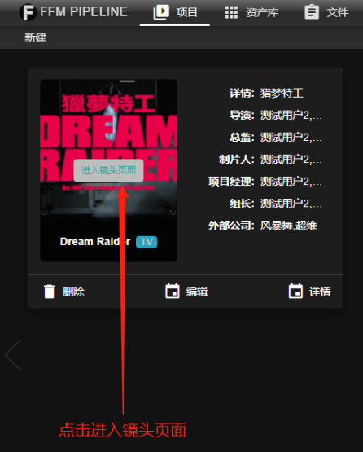**

## 新建
所有的新建操作, 都可以通过工具栏的新建按钮完成(ps: 也可以通过快捷方式,见下文).
**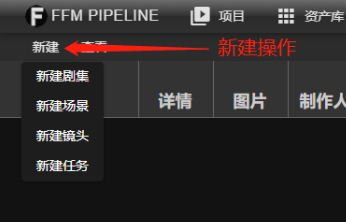**

### 新建剧集按钮
点击 **** 按钮下的 **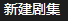** 打开新建集的 **对话框**:

**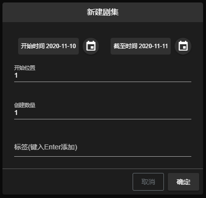**

信息确认后点击 **确定** 完成新建.
> 注:
> - **FILM电影** 类型的项目没有该选项
> - 集的新建为批量创建, 集数会根据位置和数量自动填写
> - 新建集的集合中不能包含已创建的集. 如: 第 3 集已创建, 新建 1 - 5 集, 会禁止创建
> - 标签操作请查看 [创建标签](#创建标签)

### 新建场景

#### 新建场景按钮
点击 **** 按钮下的 **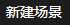** 打开新建场景的 **对话框**:

**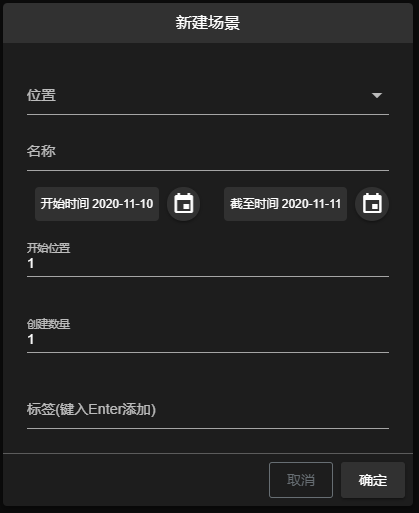**
通过 **位置选项** 选择新建在哪一集下.
信息确认后点击 **确定** 完成新建.
> 注:
> - **FILM电影** 下不需要选择位置, 直接创建在根下
> - 场景的新建为批量创建, 场景名称会根据位置和数量自动填写
> - 如果有填写名称, 自动填写名称功能失效, 批量创建的所有场景都是该名称
> - 名称为选填项, 至多 20 字符
> - 标签操作请查看 [创建标签](#创建标签)

#### 集下新建场景(TV)
需要通过修改集对话框下的 `新建子项` 按钮打开新建对话框, 新建该集下的场景(ps: 该新建模式下不可更改场景位置), 修改剧集的方式见 [修改集](#修改集)

### 新建镜头

#### 新建镜头按钮
点击 **** 按钮下的 **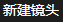** 打开新建镜头的 **对话框**:

**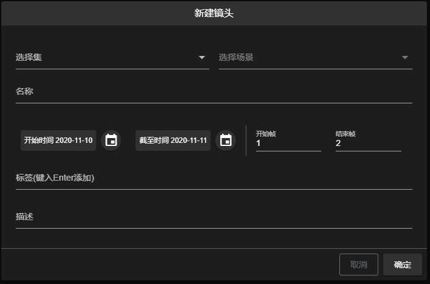**
通过 **位置选项** 选择新建在哪一场景下.
信息确认后点击 **确定** 完成新建.
> 注:
> - 需要选择包含场景的集, 再选择场景, 才可以完成位置的选择
> - **FILM电影** 下不需要选择集, 直接选择场景即可
> - 名称为必填项, 至多 20 字符
> - 描述为选填项, 至多 500 字符
> - 开始帧与结束帧需大于 0
> - 标签操作请查看 [创建标签](#创建标签)

#### 场景下新建镜头
需要通过修改场景对话框下的 `新建子项` 按钮打开新建对话框, 新建该场景下的镜头(ps: 该新建模式下不可更改镜头位置), 修改场景的方式见 [修改场景](#修改场景)

### 新建任务

#### 新建任务按钮
点击 **** 按钮下的 **** 打开新建任务的 **对话框**:

**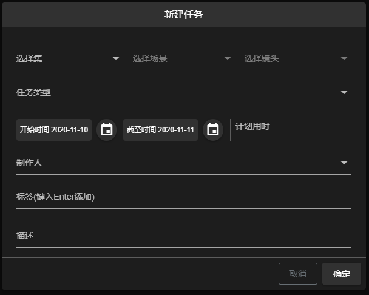**
通过 **位置选项** 选择新建在哪一镜头下.
信息确认后点击 **确定** 完成新建.
> 注:
> - 需要选择包含场景的集, 再选择包含镜头的场景, 再选择镜头, 才可以完成位置的选择
> - **FILM电影** 下不需要选择集, 直接选择场景即可
> - 描述为选填项, 至多 500 字符
> - 开始帧与结束帧需要大于 0
> - 标签操作请查看 [创建标签](#创建标签)

#### 镜头下新建任务
选择修改镜头对话框中的 **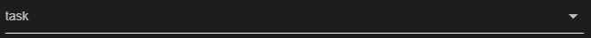** 可直接新建该镜头下的任务(ps: 该新建模式下不可选择位置)
**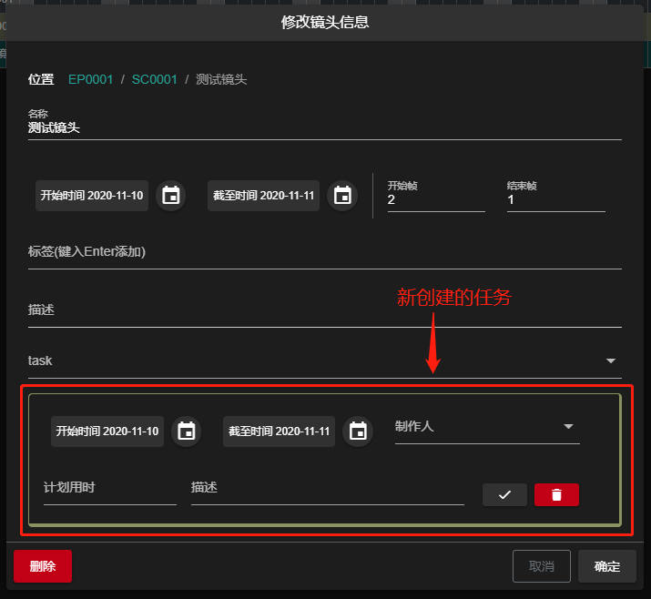**
修改镜头的方式见 [修改镜头](#修改镜头)

## 修改
修改的两种方式
- 通过点击 **** 按钮下的 **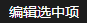**
- 双击所在行打开

### 修改集
点击 **** 按钮下的 **** 或双击剧集所在行打开编辑 **对话框**:

**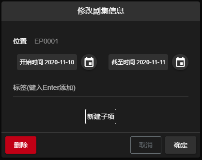**
信息确认后点击 **确定** 完成编辑.

### 修改场景
点击 **** 按钮下的 **** 或双击场景所在行打开编辑 **对话框**:

**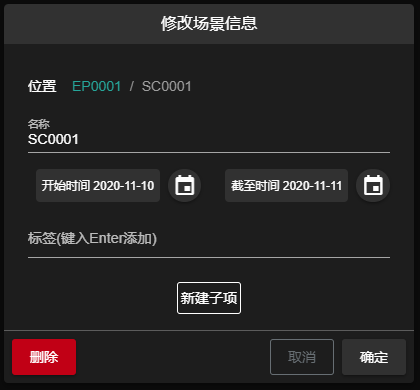**
信息确认后点击 **确定** 完成编辑.

### 修改镜头
点击 **** 按钮下的 **** 或双击镜头所在行打开编辑 **对话框**:

**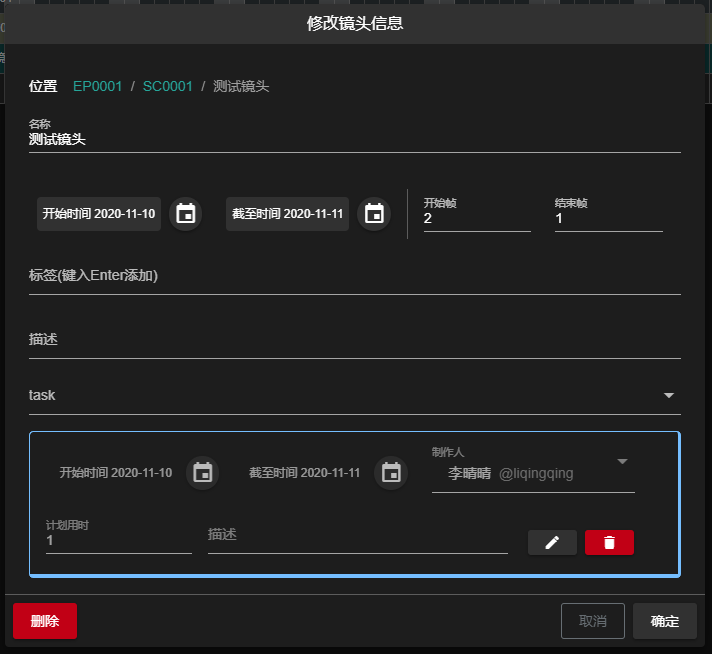**
信息确认后点击 **确定** 完成编辑.
> 注:
> - 需要确定镜头下所有任务的信息才可以完成编辑.
>   - 任务框中除描述外, 其他均为必填项
>   - 未确定的任务
>   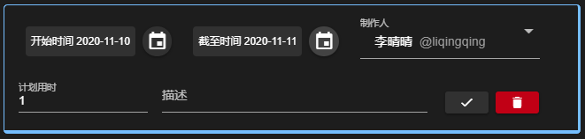
>   - 已确定的任务
>   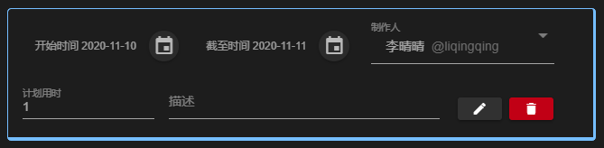

### 修改任务
点击 **** 按钮下的 **** 或双击任务所在行打开编辑 **对话框**:

**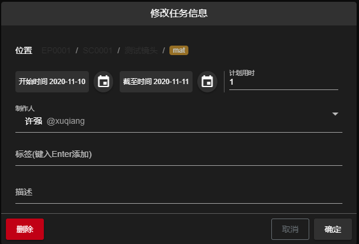**
信息确认后点击 **确定** 完成编辑.

## 删除
所有的删除都可以通过编辑对话框中的 **** 按钮完成, 编辑对话框的打开方式见 [这里](#修改)

## 查询
通过工具栏 **** 按钮下的 **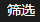** 按钮打开查询 **对话框**:
**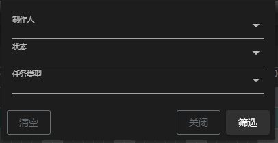**
> 注
> - 筛选的所有选项均为多选
> - 筛选条件可以任意选择其中的一项或几项
> - 点击 **清空** 可清空筛选条件, 需要通过右下角的 **筛选** 按钮完成操作

## 查看提交
查看提交的两种方式
- 选中任务所在行, 通过工具栏 **** 按钮下的 **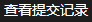** 查看
- 右击 gantt条的 **** , 点击右键菜单的 **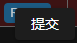** 按钮查看

### 准备
任务创建后默认状态为 `准备(Ready)`

**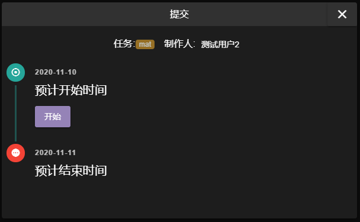**
点击 **** 按钮, 进入[工作中](#工作中)

### 工作中
任务执行 **开始工作/重新开始** 后状态为 `工作中(Working)`
**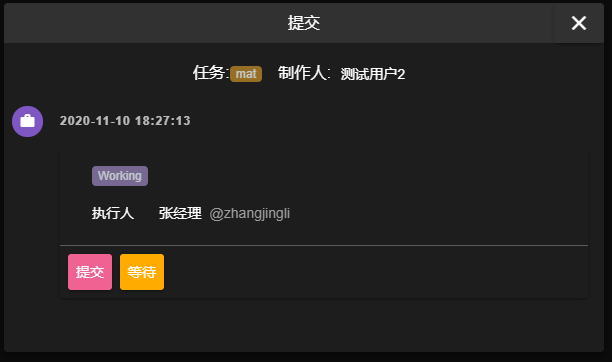**
> 提交按钮
> - 点击 **** 按钮, 打开提交栏
> **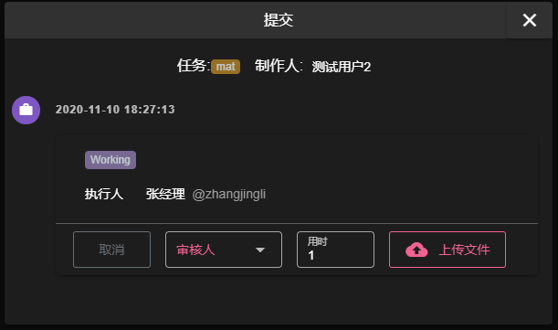**
> - 选择审核人(必填)以及填写该项提交用时(必填)后, 上传文件
> **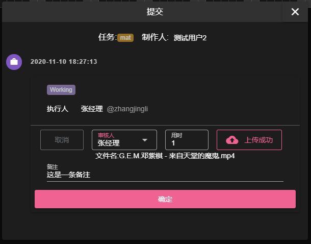**
> - 文件上传完成, 填写备注(选填)点击确定完成提交, 状态调整为[提交](#提交).

> 等待按钮
> - 点击 **** 按钮, 打开等待栏
> **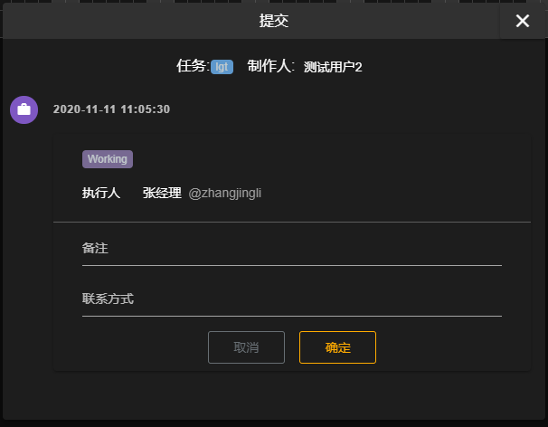**
> - 填写备注(必填)及联系方式(必填), 点击确定完成等待, 状态调整为[等待](#等待).

### 等待
任务在工作中点击 **等待** 后状态为 `等待中(Wait)` 

**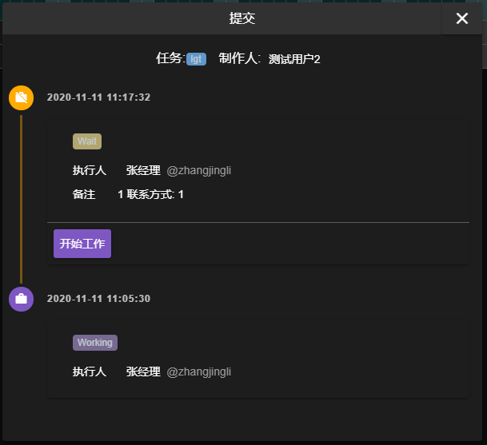**
点击 **** 按钮, 状态调整为[工作中](#工作中)

### 提交
任务在工作中点击 **等待** 后状态为 `等待中(Wait)`

**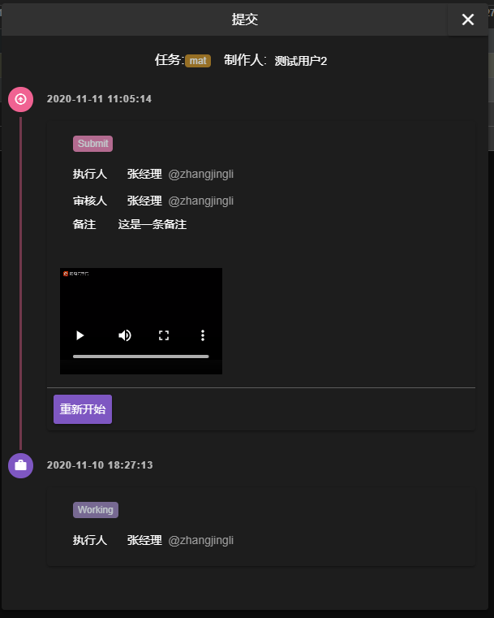**
点击 **** 按钮, 状态调整为[工作中](#工作中)

### 拒绝
**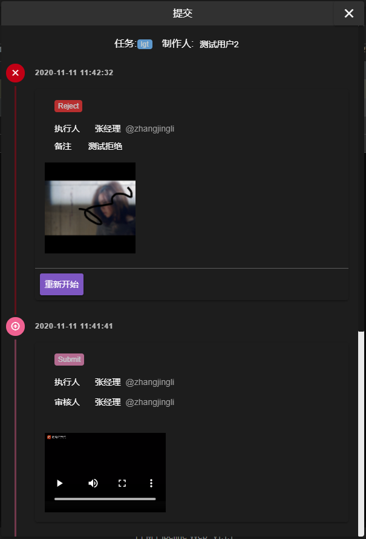**
点击 **** 按钮, 状态调整为[工作中](#工作中)

### 完成
****
点击 **** 按钮, 状态调整为[工作中](#工作中)

### 外部审核
**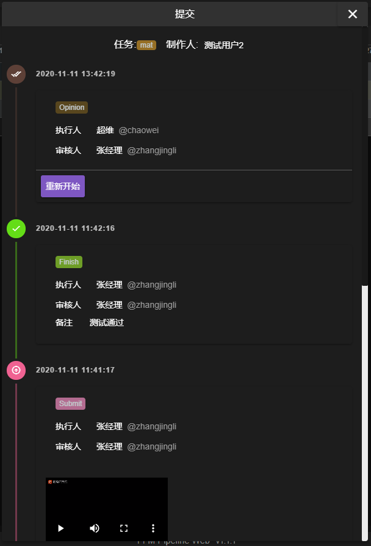**
点击 **** 按钮, 状态调整为[工作中](#工作中)

### 终审
**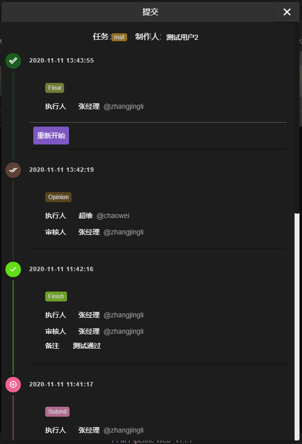**
点击 **** 按钮, 状态调整为[工作中](#工作中)

## 查看工时
查看提交的两种方式
- 选中任务所在行, 通过工具栏 **** 按钮下的 **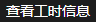** 查看
- 右击 gantt条的 **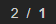** , 点击右键菜单的 **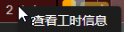** 按钮查看

工时信息用来展示该任务制作总时长, 并且显示该任务的历史提交记录
**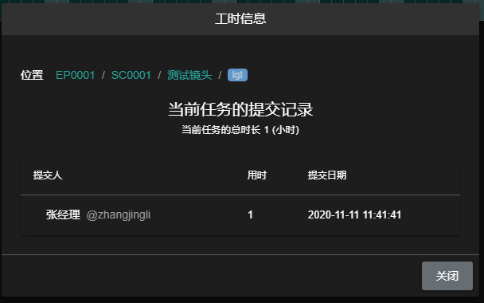**

## 创建标签
在 **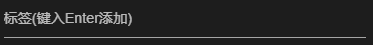** 输入想要新建的标签, 按 `回车键` 完成创建

